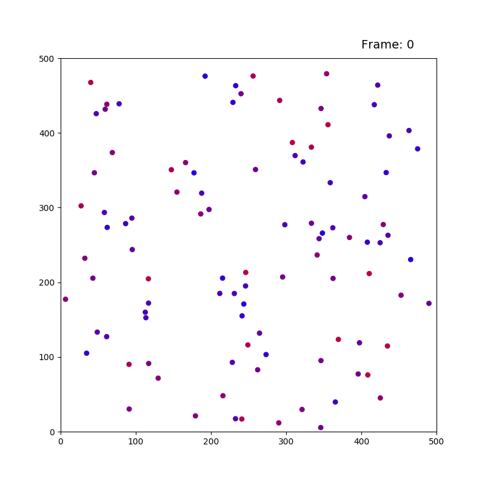

# CS3210 - Assignment 1 & 2
### Particle Movement Simulator using Parallel Programming

CS3210 Assignment Repository - written in C/C++

### Directory structure
- Assignment PDFs in root 
- Assignment 1A (OpenMP) in directory `/openmp`
    - Sequential implementation in `/sequential`
    - Naive parallel implementation in `/parallel`
    - Parallel implementation with pruning in `/parallel-2`
    - Report and data in `/report`
- Assignment 1B (CUDA) in directory `/cuda`
    - Parallel CUDA implementation in `/parallel`
    - Report and data in `/report`
- Assignment 2 (OpenMPI) in directory `/mpi`
	- Distributed MPI implementation in `/parallel`
    - Report and data in `/report`

### Visualisation

